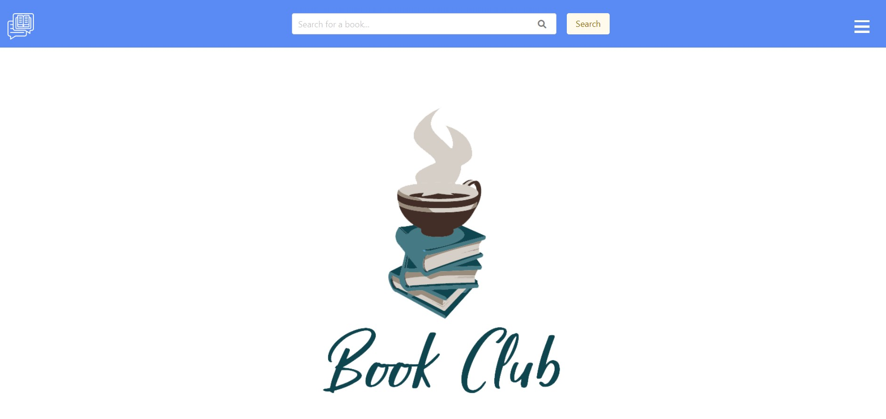
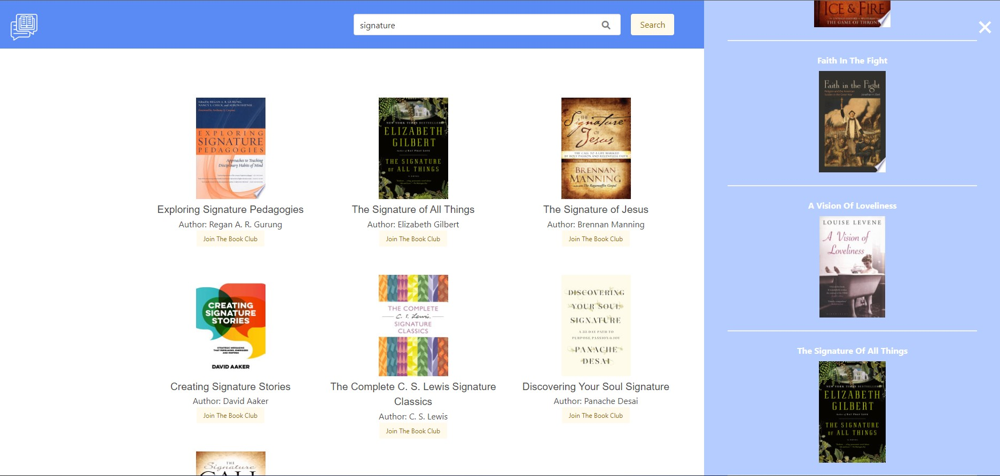
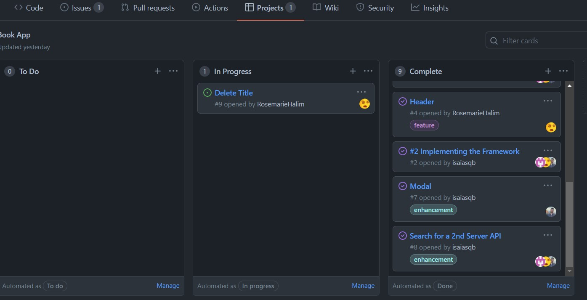

#  Book Club and Reading List App
---



##  User Story

AS A user
I WANT to search a book by title and read reviews
SO THAT I can decide whether or not to read the book

## Project Description
This webpage is for those who are looking for a specific book and possible buying options. 

When they search the title, they are provided a list of books that are related to the search with an image, title and author. When they select the book of choice they are shown the summary, author, page count, published year, and link to buy the book. 

There is also a bookmark button to add the book to the readlist which is under the hamburger menu. In the hamburger menu, the user is given a list of titles that they bookmarked along with an “edit list” option that allows the user to delete books from their list.


## Acceptance Criteria
```
GIVEN a book dashboard with form inputs and hamburger menu
WHEN I search for a book title
THEN I am presented with the book summary, aditional infomration about the book and a link to buying options.
WHEN I view summary of current book
THEN I am presented with a bookmark button that will allow me to save the book to my reading list.
WHEN I view the tag
WHEN I view hamburger menu
THEN I am presented with a reading list, and an button that gives me the option to clear my current selections
WHEN I click on home
THEN I am presented with homepage
WHEN I click on the "join book club"
THEN I am presented with the contact infomration from a book club moderator.
```



---

## Purpose
As a developer, I want to create a book title search that users can use to search to find reviews, prices, and suggestions for similar books.

## Built With
* HTML
* CSS
* JavaScript
* JQuery
* BULMA
---

## Website
https://rosemariehalim.github.io/book-review/

---

## Project Tab  

Please reffer to the Project tab for a full list of issues and plans for future development

https://github.com/RosemarieHalim/book-review/projects/1



## Team Members

https://github.com/RosemarieHalim
https://github.com/isaiasqb
https://github.com/AgentA12